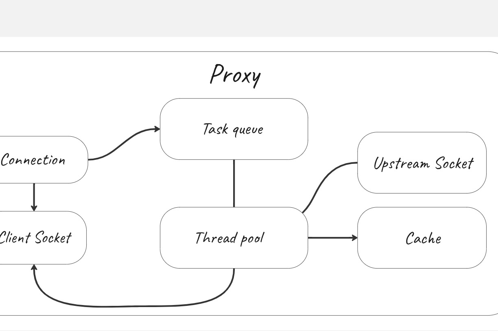

<h1 align="center">HTTP-proxy</h1>





## Building

You will need the make utility and GLib to build:
```
sudo apt install make
sudo apt install libglib2.0-dev
```

In the root directory, use make to get a build directory with the proxy executable file.
```
make
```
## Usage
To run the proxy with default parameters in the root directory, use:
```
./build/proxy
```

To display information about launch parameters, use:
```
--help -h
```

To select a port use:
```
--port -p
```

To select a cache-mode:
```
--mode cache
```
To select a upstream-mode:
```
--mode upstream
```


To specify the number of threads in the thread pool, use:
```
--threads -t
```

To specify the cache ttl(useless in upstream mode), use:
```
--ttl
```
To specify the cache max-size(useless in upstream mode), use:
```
--size -s
```

To run the proxy with default parameters after building, use:
```
make run
```
Example(in the root directroy):
```
./build/proxy --threads 100 --port 8080 --mode cache --ttl 25 --size 30
```


