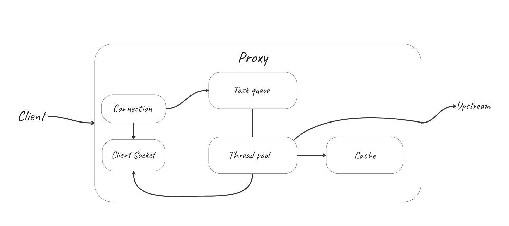

<h1 align="center">HTTP-proxy</h1>





## Building

You will need the make utility to build:
```
sudo apt install make
```

In the root directory, use make to get a build directory with the proxy executable file.
```
make
```
## Usage
To run the proxy with default parameters in the build directory, use:
```
./proxy
```

To display information about launch parameters, use:
```
--help -h
```


To select a port use:
```
--port -p
```

To specify the number of threads in the thread pool, use:
```
--threads -t
```

To run the proxy with default parameters after building, use:
```
make run
```


